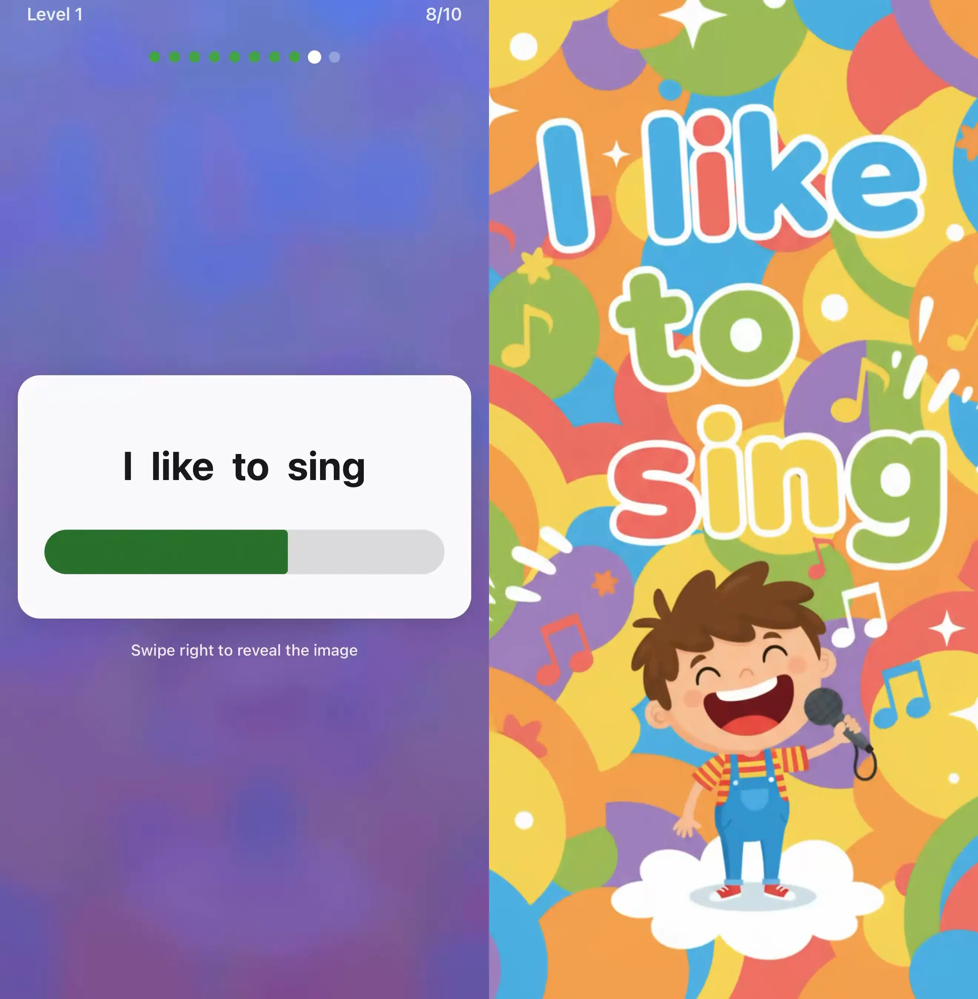

# Early Reader App

A mobile app implementing the **DISTAR phonics methodology** pioneered by Siegfried Engelmann, combined with **spaced repetition** learning algorithms and a touch of AI.

## 👨‍👧 Who Is This For?

I built this app for my 4-year-old daughter to help her learn to read before starting first grade. As a parent, I wanted something based on proven research rather than gamified edutainment—and I'm sharing it with other parents who feel the same way.

**Early Reader is designed for:**
- 💒 Pre-schoolers (ages 3-6) learning to read
- 👪 Parents who want a research-backed approach
- 🏠 Homeschooling families
- 👩‍🏫 Tutors and educators using phonics-based instruction



## ✨ What Makes This Special

This isn't just another flashcard app. Early Reader is built on decades of research:

- **DISTAR Phonics**: A systematic, phonics-first approach developed by Siegfried Engelmann that has been proven effective for teaching children to read
- **Spaced Repetition (SM-2)**: The same algorithm used by Anki and SuperMemo, optimized for long-term retention
- **AI-Powered Cards**: Contextual word generation and imagery that adapts to your child's learning journey

## 📊 Content Stats

The app includes a comprehensive curriculum with pre-generated assets:

| Category | Cards | Description |
|----------|-------|-------------|
| **Letters (Phonemes)** | 31 | Individual letter sounds (a, m, s, etc.) |
| **Digraphs** | 12 | Two-letter combinations (sh, th, ch, etc.) |
| **Words** | 590 | Decodable words built from learned phonemes |
| **Sentences** | 88 | Simple sentences for reading practice |
| **Total Cards** | **721** | Complete DISTAR-based curriculum |

### Asset Breakdown

- 🖼️ **721 images** — AI-generated illustrations for each card
- 🔊 **4,195 audio files** — Professional voice recordings including:
  - Word/phoneme pronunciations
  - Prompts ("What sound does this make?")
  - Encouragement ("Great job!")
  - Hints and retry prompts

## 🚀 Getting Started

### Prerequisites

- **Node.js** 18+
- **Git LFS** (for large assets like images and audio files)
- **Expo CLI** (`npm install -g expo-cli`)
- **iOS Simulator** (macOS) or **Android Emulator**

### Installation

```bash
# Clone the repository
git clone https://github.com/melvinmt/early-reader-app.git
cd early-reader-app

# Install Git LFS (if not already installed)
# macOS
brew install git-lfs

# Ubuntu/Debian
sudo apt install git-lfs

# Initialize Git LFS
git lfs install
git lfs pull

# Install dependencies
npm install
```

### Running the App

#### Development Mode (Expo Go)

**Note**: Speech recognition features require a native build and cannot run in Expo Go. For full functionality, use native development mode (see below).

```bash
# Start the development server
npm start

# Or use the init script
./init.sh
```

Then:
- Press `i` for iOS Simulator
- Press `a` for Android Emulator
- Scan QR code with Expo Go app on physical device

#### Native Development (Required for Speech Recognition)

Speech recognition features require a native build. Follow these steps:

1. **Install dependencies and prebuild native code**:
```bash
# Install npm dependencies
npm install

# Generate native iOS/Android projects
# Use WITHOUT --clean to preserve existing Xcode project settings
# Only use --clean if you need a completely fresh start
npx expo prebuild

# For iOS, install CocoaPods dependencies
cd ios && pod install && cd ..
```

**Important**: 
- Use `npx expo prebuild` (without `--clean`) to preserve your existing Xcode project settings
- Only use `npx expo prebuild --clean` when you need a completely fresh native project (this will overwrite all custom settings)
- If you have custom Xcode settings, consider using [Expo config plugins](https://docs.expo.dev/guides/config-plugins/) to apply them programmatically

2. **Run on a physical device** (speech recognition requires a physical device):
```bash
# For iOS - requires physical device connected
npx expo run:ios --device

# For Android - can use emulator or physical device
npx expo run:android
```

**Important Notes**:
- **iOS Simulator does NOT support speech recognition** - you must use a physical iOS device
- After prebuild, always use `npx expo run:ios` or `npx expo run:android` rather than opening Xcode/Android Studio directly
- The app will gracefully degrade if microphone/speech permissions are denied - it will work normally without pronunciation checks

#### Permissions

The app requests the following permissions:
- **Microphone**: Required for speech recognition to help children practice pronunciation
- **Speech Recognition**: Required to validate pronunciation accuracy

Both permissions are optional - the app functions normally if permissions are denied, just without pronunciation validation features.

## 📁 Project Structure

```
early-reader-app/
├── app/                    # Expo Router screens
│   ├── auth/              # Authentication screens
│   ├── onboarding/        # Onboarding flow
│   └── ...
├── src/
│   ├── components/        # Reusable UI components
│   ├── services/          # API and storage services
│   │   └── storage/      # SQLite database
│   ├── stores/           # Zustand state stores
│   └── types/            # TypeScript types
├── scripts/              # Build and generation scripts
├── features.json         # Feature tracking
└── claude-progress.txt   # Development progress log
```

## 🛠 Tech Stack

- **Framework**: React Native + Expo
- **Navigation**: Expo Router
- **State Management**: Zustand
- **Database**: SQLite (local-first)
- **Animations**: React Native Reanimated + Lottie

## 📚 The DISTAR Method

DISTAR (Direct Instruction System for Teaching Arithmetic and Reading) was developed by Siegfried Engelmann in the 1960s. Key principles include:

1. **Explicit phonics instruction** - Teaching letter-sound relationships directly
2. **Carefully sequenced lessons** - Building skills progressively
3. **Immediate feedback** - Correcting errors right away
4. **High engagement** - Keeping children actively involved

Combined with spaced repetition, this approach maximizes retention while minimizing study time.

## 🤝 Contributing

We welcome contributions! Here's how to get involved:

1. Fork the repository
2. Create a feature branch (`git checkout -b feature/amazing-feature`)
3. Commit your changes (`git commit -m 'Add amazing feature'`)
4. Push to the branch (`git push origin feature/amazing-feature`)
5. Open a Pull Request

### Contributor License Agreement

Because this project has a commercial release on the App Store and Google Play, all contributors must sign a **Contributor License Agreement (CLA)**. This grants Instalabs, LLC the right to include your code in our app store releases while keeping your contribution open source for the community.

## 📄 License

This project is dual-licensed to support both open research and sustainable development:

- **Community Use**: The source code is available under the **GNU Affero General Public License v3.0 (AGPLv3)**. This ensures that the research and educational methodology remain open for everyone to learn from and improve.

- **Commercial Use**: The official builds on the Apple App Store and Google Play are published by Instalabs, LLC under a standard commercial license.

---

Copyright © 2025-2026 Instalabs, LLC
